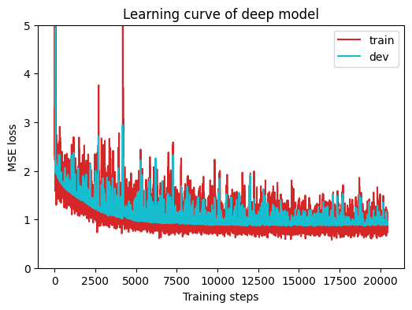
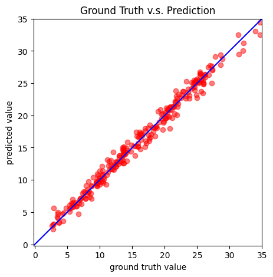

# HW1: COVID-19 Cases Prediction (Regression)

Predict day 3 `tested_positive` from survey and case data across 40 US states, using a small fully connected network in PyTorch. The data is 2700 labeled rows split into 2430 train and 270 dev, plus 893 unlabeled test rows.

## Model

59 input features (39 state columns plus the top 20 by SelectKBest `f_regression`) into `Linear(59, 64)`, `ReLU`, `Linear(64, 1)`. Loss is MSE plus an L2 penalty on the weights with lambda 0.001.

SGD with lr 0.001 and momentum 0.9, batch size 270, early stopping with patience 500.

## Result

Best dev loss **0.8616** at epoch 1771, early stopped at 2272. The assignment target was 0.89. Without the L2 term the dev MSE is 0.8400.

As a sanity check, predicting day 3 = day 2 gives MSE 1.0486, so the model is roughly 20% better than that baseline rather than just echoing the strongest input feature.

Train and dev track each other for the whole run with no gap opening at the end, so there is no overfitting. Predictions follow the diagonal from about 3 to 34, with the widest spread in the 15 to 25 range where most of the data sits.

## Files

| File | Contents |
| --- | --- |
| `HW1_formal.ipynb` | The notebook with outputs. Summary and AI use disclosure are at the bottom. |
| `pred.csv` | Test set predictions, 893 rows |
| `learning_curve.png`, `prediction.png` | Plots from the final run |
| `HW1_Dataset.zip` | Provided dataset |

## Running it

Open in Colab on a GPU runtime. `cal_loss` hardcodes `.to('cuda')`, so it will not run on CPU. Update the Drive path in the unzip cell, then Run All. Seeded at 42069, so it reproduces to 0.8616.

## AI Use Disclosure

Anthropic Claude Code was utilized on this assignment. Its contributions were: assistance with the explanatory comments next to each TODO and the summary. All code outside the TODO markers is the provided template, unmodified apart from the dataset path. I reviewed and ran the final notebook.

## Documentation Referenced

Model definition (`NeuralNet`):

- `nn.Linear` - https://pytorch.org/docs/stable/generated/torch.nn.Linear.html
- `nn.ReLU` - https://pytorch.org/docs/stable/generated/torch.nn.ReLU.html
- `nn.MSELoss` - https://pytorch.org/docs/stable/generated/torch.nn.MSELoss.html
- `torch.norm` (L2 regularization) - https://pytorch.org/docs/stable/generated/torch.norm.html

Training:

- `Optimizer.zero_grad` - https://pytorch.org/docs/stable/generated/torch.optim.Optimizer.zero_grad.html
- `Tensor.backward` - https://pytorch.org/docs/stable/generated/torch.Tensor.backward.html
- `Optimizer.step` - https://pytorch.org/docs/stable/generated/torch.optim.Optimizer.step.html

Hyperparameters and model construction:

- `torch.optim.SGD` (lr, momentum) - https://pytorch.org/docs/stable/generated/torch.optim.SGD.html
- `nn.Module.to` (moving the model to GPU) - https://pytorch.org/docs/stable/generated/torch.nn.Module.html#torch.nn.Module.to
