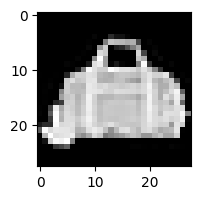

# HW2: Fashion-MNIST Classification (CNN and RNN)

Classify Fashion-MNIST into 10 clothing classes, first with a small convolutional network, then comparing a plain RNN, a GRU and an LSTM that read each image as a 28 step sequence of rows. The data is 60,000 training and 10,000 test images, 28x28 grayscale.

## CNN

`conv1` (1 to 8, 3x3, padding 1) into ReLU into 2x2 max pool, then `conv2` (8 to 16, 3x3, padding 1) into ReLU into pool, then `Linear(784, 10)`. Padding 1 with a 3x3 kernel leaves height and width unchanged, so only the two pools shrink the map, 28 to 14 to 7. With conv2's 16 channels that is 16\*7\*7 = 784 into the classifier.

Adam with lr 1e-4, batch size 64, 10 epochs, cross entropy loss. 9,098 parameters in the forward path. The template also attaches `model.classifier` (52,310 parameters) that `forward` never calls, so it goes into the optimizer but never receives a gradient.

## Recurrent models

Each image is read as 28 timesteps of 28 features. Input size 28, hidden size 256, 3 layers, `batch_first=True`. The output layer is `Linear(hidden_size * 28, 10)`, so it sees all 28 timesteps concatenated rather than just the final hidden state.

Adam with lr 0.005, batch size 64, 3 epochs for each of the three models.

## Results

The CNN reaches **85.59%** train and **84.87%** test. Loss falls from 1.1298 at epoch 1 to 0.4108 at epoch 10 and is still dropping when it stops.

| Model | Parameters | Train | Test |
| --- | --- | --- | --- |
| CNN | 9,098 | 85.59 | 84.87 |
| RNN | 408,074 | 49.85 | 49.40 |
| GRU | 1,080,842 | 88.09 | 86.80 |
| LSTM | 1,417,226 | 89.40 | 87.57 |

The plain RNN lands at about half the accuracy of the gated models. 28 timesteps through 3 stacked tanh layers is deep enough for gradients to vanish, and lr 0.005 is high for it. GRU and LSTM have gate paths to carry gradient, so they train fine at that same setting. LSTM beats GRU by 0.77 points on test for 31% more parameters.

Train and test gaps are small everywhere, 0.72 for the CNN, 0.45 RNN, 1.29 GRU and 1.83 LSTM, so nothing is overfitting yet. The three recurrent models only saw 3 epochs.

The comparison worth making is the CNN against the RNN: 84.87 from 9,098 parameters versus 49.40 from 408,074. Convolution's spatial prior fits a 28x28 image far better than reading it as a sequence of rows.

One caveat on the split. `val_dataset` and `test_dataset` are both `FashionMNIST(train=False)`, the same 10,000 images, so validation accuracy in the CNN section is test accuracy. There is no held-out set to tune against.

## Files

| File | Contents |
| --- | --- |
| `HW2-formal.ipynb` | The notebook with outputs. Summary and AI use disclosure are at the bottom. |
| `plot-sample.png` | Sample image from the visualization cell |
| `dataset.zip` | Provided dataset |

## Running it

Open in Colab on a GPU runtime and Run All. `datasets.FashionMNIST(..., download=True)` fetches the data itself, so `dataset.zip` does not need to be unzipped and there is no path to configure. It is committed here only because it came with the assignment.

No seed is set anywhere in the notebook, so accuracies move by a few tenths between runs and will not reproduce the table exactly.

## AI Use Disclosure

Anthropic Claude Code was utilized on this assignment. Its contributions were: assistance with the explanatory comments next to updated TODO items and the summary. All code outside the TODO markers is the provided template, unmodified. I personally modified, reviewed, and ran the final notebook.

## Documentation Referenced

CNN:

- `nn.Conv2d` - https://pytorch.org/docs/stable/generated/torch.nn.Conv2d.html
- `nn.MaxPool2d` - https://pytorch.org/docs/stable/generated/torch.nn.MaxPool2d.html
- `nn.Linear` - https://pytorch.org/docs/stable/generated/torch.nn.Linear.html
- `F.relu` - https://pytorch.org/docs/stable/generated/torch.nn.functional.relu.html

Recurrent models:

- `nn.RNN` - https://pytorch.org/docs/stable/generated/torch.nn.RNN.html
- `nn.GRU` - https://pytorch.org/docs/stable/generated/torch.nn.GRU.html
- `nn.LSTM` - https://pytorch.org/docs/stable/generated/torch.nn.LSTM.html
- `Tensor.reshape` (flattening the time axis before fc) - https://pytorch.org/docs/stable/generated/torch.Tensor.reshape.html

Loss, training and evaluation:

- `nn.CrossEntropyLoss` - https://pytorch.org/docs/stable/generated/torch.nn.CrossEntropyLoss.html
- `torch.optim.Adam` - https://pytorch.org/docs/stable/generated/torch.optim.Adam.html
- `torch.no_grad` - https://pytorch.org/docs/stable/generated/torch.no_grad.html
- `Tensor.max` (pulling the predicted class) - https://pytorch.org/docs/stable/generated/torch.Tensor.max.html
- `nn.Module.eval` - https://pytorch.org/docs/stable/generated/torch.nn.Module.html#torch.nn.Module.eval

Dataset:

- `torchvision.datasets.FashionMNIST` - https://pytorch.org/vision/stable/generated/torchvision.datasets.FashionMNIST.html
